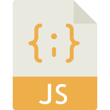
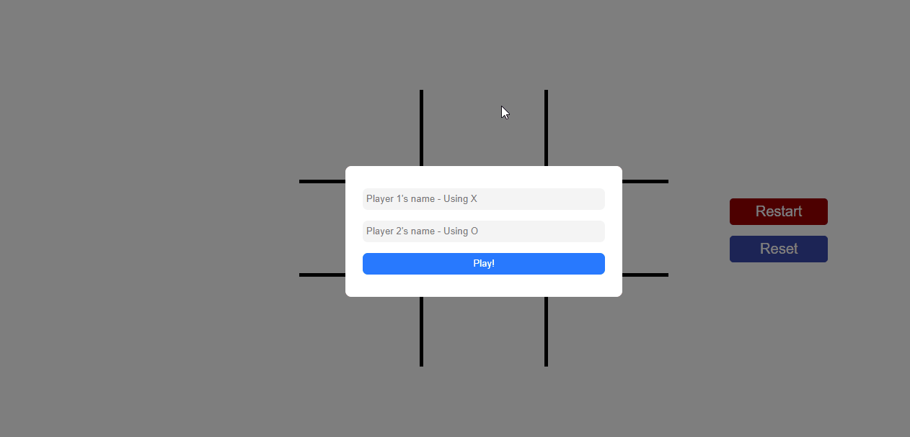

# Project Name

> One paragraph statement about the project.

Additional description about the project and its features.

## Built With

- Major languages,
- frameworks,
- technologies used

## Live Demo

[Live Demo Link](https://livedemo.com)

## Getting Started

**This is an example of how you may give instructions on setting up your project locally.**
**Modify this file to match your project, remove sections that don't apply. For example: delete the testing section if the currect project doesn't require testing.**

To get a local copy up and running follow these simple example steps.

### Prerequisites

### Setup

### Install

### Usage

### Run tests

### Deployment

## Authors

👤 **Author1**

- Github: [@githubhandle](https://github.com/githubhandle)
- Twitter: [@twitterhandle](https://twitter.com/twitterhandle)
- Linkedin: [linkedin](https://linkedin.com/linkedinhandle)

👤 **Author2**

- Github: [@githubhandle](https://github.com/githubhandle)
- Twitter: [@twitterhandle](https://twitter.com/twitterhandle)
- Linkedin: [linkedin](https://linkedin.com/linkedinhandle)

## 🤝 Contributing

Contributions, issues and feature requests are welcome!

Feel free to check the [issues page](issues/).

## Show your support

Give a ⭐️ if you like this project!

## Acknowledgments

- Hat tip to anyone whose code was used
- Inspiration
- etc

## 📝 License

This project is [MIT](lic.url) licensed.
########################################################################

# Tic Tac Toe Game

 

  

  <h3 align="center">Tic Tac Toe Game</h3>

  

    A Tic Tac ToeGame App.
     
    <a href="https://github.com/simandebvu/tic-tac-toe-javascript"><strong>Explore the docs »</strong></a>
     
     
    <a href="https://github.com/simandebvu/tic-tac-toe-javascript/issues/">Report Bug</a>
    ·
    <a href="https://github.com/simandebvu/tic-tac-toe-javascript">Request Feature</a>
  

> A tic-tac-toe game that involves two players, gameboard that contains nine cells. Players take turn to place either letter X or O into the cell. Whoever has his letter on lined on the the three consecutive row cells, column cells or diagonal cells wins the game.

## Built With

- Javascript
- Node
- Webpack 
- Bootstrap
- VSCode
- JSHint
- Github Actions

## Live Demo

[Live Demo Link](https://github.com/simandebvu/tic-tac-toe-javascript)

<!-- INSTALLATION -->
## Usage

- You can download onto your machine and open `index.html`.
  
## Authors

👤 **Shingirayi Mandebvu**

- Github: [@simandebvu](https://github.com/simandebvu)
- Twitter: [@simandebvu](https://twitter.com/simandebvu)
- Linkedin: [linkedin](https://linkedin.com/in/simandebvu)

👤 **Qoosim AbdulGhaniyy**

- Github: [@Qoosim](https://github.com/Qoosim)
- Twitter: [@qoosim_ayinde](https://twitter.com/qoosim_ayinde)
- Linkedin: [linkedin](https://linkedin.com/in/qoosim)
- 
## 🤝 Contributing

Contributions, issues and feature requests are welcome!

Feel free to check the [issues page](issues/).

## Show your support

Give a ⭐️ if you like this project!

## Acknowledgments

- Microverse

## 📝 License

This project is [MIT](lic.url) licensed.
